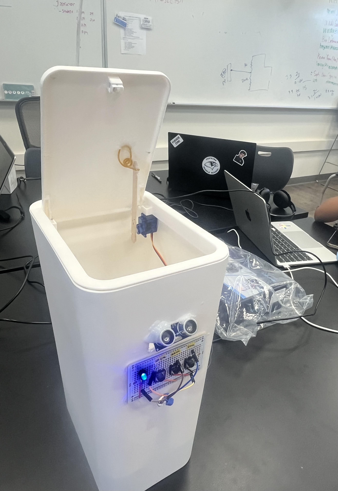
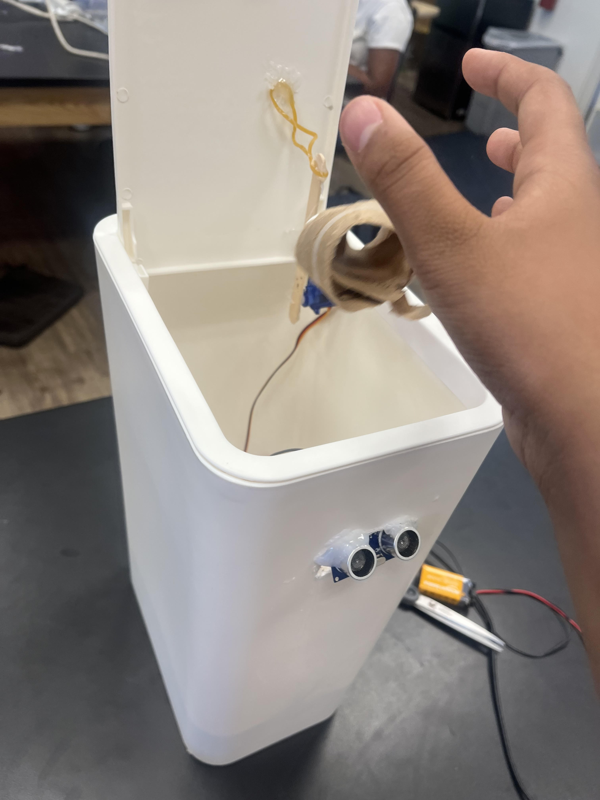
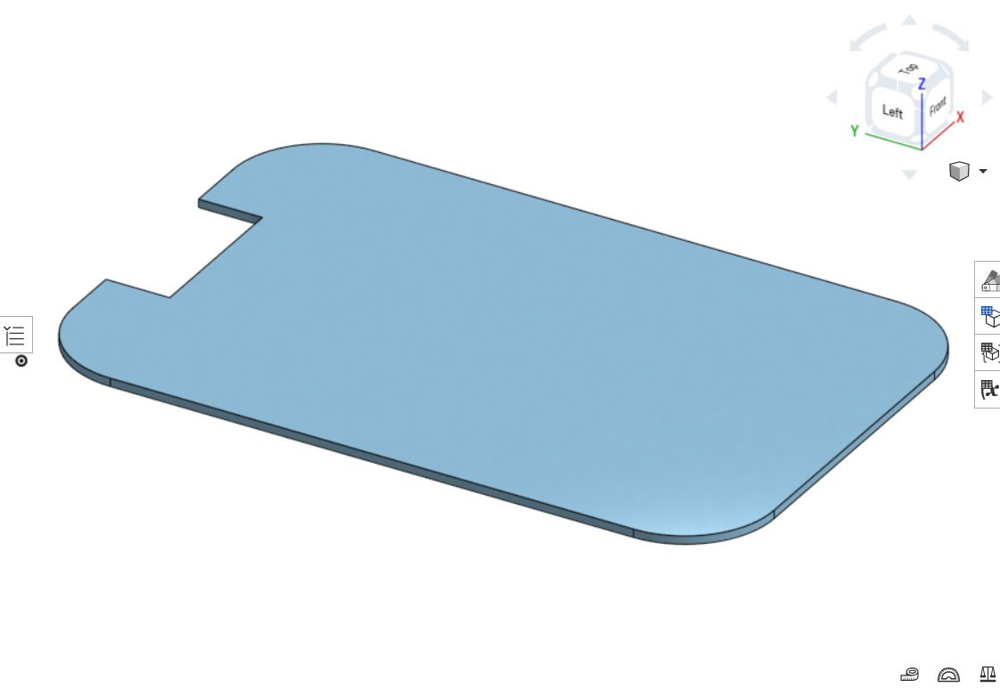
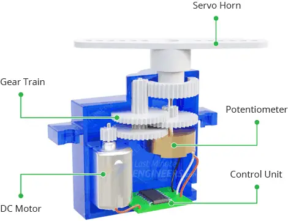
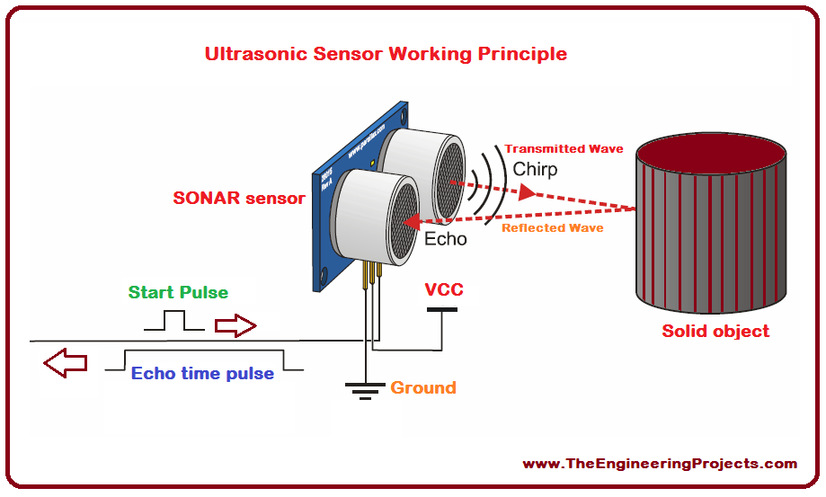
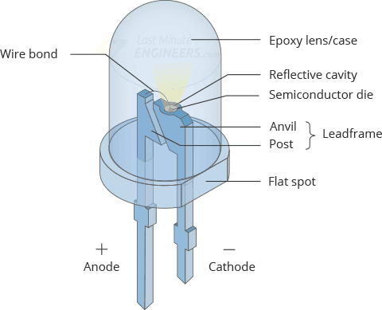
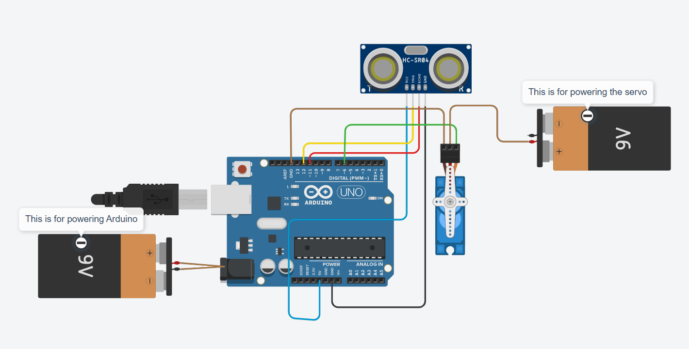
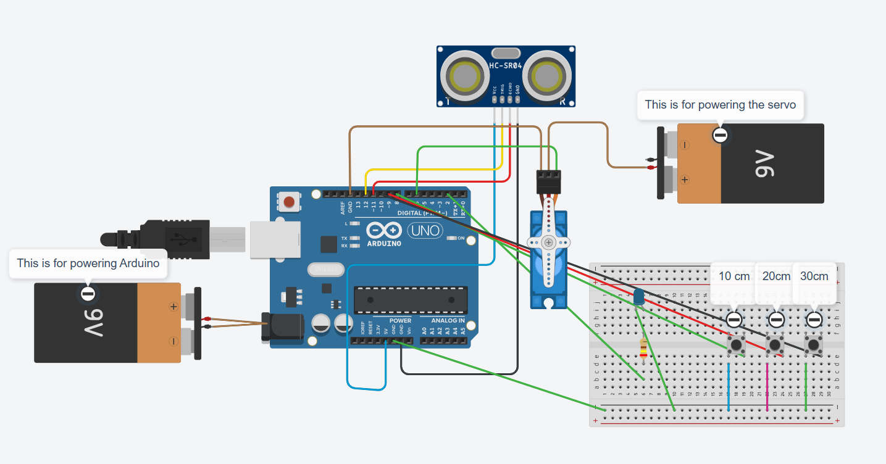

# Aryaman-BlueStamp-SmartBin
For BlueStamp I chose to make the smart bin. The bin uses an ultrasonic sensor and servo motor to open the lid if your hand is near. Becuase of this, you do not need to touch the dirt lid of the trash can. 


| **Engineer** | **School** | **Area of Interest** | **Grade** |
|:--:|:--:|:--:|:--:|
|Aryaman C | William Hopkins Middle School| Robotics | Rising 7th Grader



# Modifications
After I finished my base projects I decided I wanted to add on more upgrades.
## Modification 1: Range Selection
For my first modification I used a row of 3 push buttons on a pcb board to be able to change the range of my sensor. The button labled 10cm would make the range 10cm. This is the same for the 20 cm and 30cm. I added this becuase some people may have thaught the default of 10cm would have to sensitive or too less sensitve. SO to make everyone happy, I had a panel of buttons where you could customize the range.
## Modification 2: LED
For My second I attached an LED to my panel. This LED will turn on whenever the bin is open, indiccating it is in range. 

## Modification 3:QR code to Instruction to how to use
On my bin I put a QR code. This code leads to a pdf with instructions to how to use smart bin.


  
# Final Milestone


<iframe width="560" height="315" src="https://www.youtube.com/embed/ZArYI0z0Kjk?si=JeUcnhz7dF_TYIQR" title="YouTube video player" frameborder="0" allow="accelerometer; autoplay; clipboard-write; encrypted-media; gyroscope; picture-in-picture; web-share" referrerpolicy="strict-origin-when-cross-origin" allowfullscreen></iframe>


For my final milestone, it has been the biggest step up. I went from an ultrasonic sensor rotating a servo to having it all attached, and opening my lid of the bin. My base project is now complete. This milestone had many challenges. The biggest challenge was that my voltage regulator was fried, meaning I could not use batteries. So for now I am stuck with using an usb cable. This is because the Arduino can only take 5 volts. So the job of the voltage regulator is to make the 9 volts from the battery 5 volts. But, now that it is gone, the arduino can no longer use the battery, and now can only use usb. Also my servo would stop working on and off. 1 time it would work, and the next it would not. From this I have learned a lot. First of all I learned not to attach ground to power, otherwise you circuit would fry becuase it could cause a short circuit, which is when there is an overload of current flowing through. If a short circuit happens you will know because smoke will start to come out of the component. I also learned how to use a dremel to cut a rectangle in my bin for my ultra sonic sensor.  In the future after Blue Stamp I hope to learn more about robotics, so that I can make more advanced projects.

## CAD
For my 3rd milestone I also used CAD, an acronym for Computer Aided Design. The software I used was Onshape, which had many useful features. The reason I used CAD was becuase I wanted to 3D print a part to be a false floor, to help have an area at the bottom of my trash can so that my circuits stay away from any trash. Using cad, I made a shape tat would fit my bin. I had to get the floor printed 3 times, becuase the part would not fit. The 3d printer would not print the exact measurments, becuase there is a certain tolerence,meaning I needed to submit multiple new models with updated measurments. To attach my false bottom I used hinges to attach the floor do the walls. With the hinge I could now open the floor like a door, so I could accses the circuits.



   
   Figure 1. Picture of my CAD Model


# Second Milestone

<!--**Don't forget to replace the text below with the embedding for your milestone video. Go to Youtube, click Share -> Embed, and copy and paste the code to replace what's below.**
-->

<iframe width="560" height="315" src="https://www.youtube.com/embed/mD9-f0Ik4v0?si=Kgptd47PjzLoFSPw" title="YouTube video player" frameborder="0" allow="accelerometer; autoplay; clipboard-write; encrypted-media; gyroscope; picture-in-picture; web-share" referrerpolicy="strict-origin-when-cross-origin" allowfullscreen></iframe>

  Since my 1st milestone I have made my ultrasonic sensor turn a servo motor, rather than an LED. This is more complex, and a much closer step to my final project, smart bin. Some technical details of what I accomplished are that I was able to use an ultrasonic sensor to make a servo rotate. 1 thing that surprised me alot was that this is not taking too long to build the different circuits. Some previous challenges I faced that I now overcame were that I am making fewer syntax errors in my code. Now I only have 1 more mile stone left, before that I have to attach all the components to the trash can and modify the code accordingly.
  
## Servos
  
   Servos are similar to motor, but a motor is a device that converts energy into mechanical motion, while a servo is a control system that uses a motor to achieve precise positioning or motion control. Servo motors work by using pulse-width modulation (PWM) to control their position, with the pulse width determining the wanted angle. The servo consists of a DC motor, gears, and a potentiometer for feedback, all put  in a control circuit. The control circuit compares the wanted position (encoded in the PWM signal) with the actual position (measured by the potentiometer) and adjusts the motor's rotation to match. In my code I also used a library called Servo.

   
   

   
   Figure 2. Diagram of how servo motor works


# First Milestone
<iframe width="560" height="315" src="https://www.youtube.com/embed/rX0uBCo3Gxs?si=nI9aSmXJP16OISlY" title="YouTube video player" frameborder="0" allow="accelerometer; autoplay; clipboard-write; encrypted-media; gyroscope; picture-in-picture; web-share" referrerpolicy="strict-origin-when-cross-origin" allowfullscreen></iframe>


  For my first mile stone I wanted to test my code and hardware to see if I could make the ultrasonic sensor activate a component. So I made my ultrasonic sensor activate my LED. This milestone helped me make huge progress technical wise. This is because now I now understand how to activate something with an ultrasonic sensor. Some challenges I faced in the first milestone was when I had errors in my code such as forgotten semi-colons at the end or misspelled words. Now that I have finished my first milestone, I plan to use my knowledge from this to help me with my final project and make my ultrasonic sensor activate a servo which will open the lid of a trash can.
  
## UltraSonic Sensor
  Ultrasonic sensors are componeents that use high-frequency sound waves to detect objects and measure distances, without needing physical contact. They emit sound waves and then listen for the echo to find out the distance to the object. This makes them useful for various applications, including obstacle detection, level sensing, and distance measurement. 
  

    
  Figure 3. Diagram of how UltraSonic sensor works


## LED
  
  LEDs (Light Emitting Diodes) work by passing an electrical current through a semiconductor material, causing it to emit light.LEDs work by passing an electrical current through a semiconductor material, causing it to emit light. There are multiple colors for LED, including red, yellow, blue and green. Out of these the blue is the newest and hardest make. Blue LEDs were difficult to develop because finding the right material with a sufficiently large band gap to emit blue light, and then fabricating it into a reliable and efficient LED, was hard. Specifically, the material gallium nitride (GaN) was needed, but creating high-quality GaN crystals and then doping them to create a p-n junction for efficient light emission was a big obsticle. 

  

Figure 4. Schematic of Ultrasonic sensor and servo motor

  

# Schematics 

## Base project Schematics


Figure 5. Schematic of Ultrasonic sensor and servo motor

## Modification Schematics


Figure 6. Schematic of my modifictions


# Starter Project 

<iframe width="560" height="315" src="https://www.youtube.com/embed/3h2w0eoCSsU?si=V4aoqzZO6Au-X5Hd" title="YouTube video player" frameborder="0" allow="accelerometer; autoplay; clipboard-write; encrypted-media; gyroscope; picture-in-picture; web-share" referrerpolicy="strict-origin-when-cross-origin" allowfullscreen></iframe>

## Desrcription: 
My starter project is an rgb slider. With this you can use sliders to change the color of the LED. I also used soder to attached the components to the board.
## Challenges: 
During making my starter project I had a few challenges. One of my first challenges was that I sauders incorrecly. This often happened because I added to much sauder. Also Some peices were not fully on the board.
## Next Steps: 
Now that I finished my starter project, I will now start on my actual project. For me it is the smart bin. The smart bin uses ultrasonic sensors to open or close a trashcan, which can be very useful. 
# All My Code

## First Milestone code:
```c++
const int trigPin = 12; 
const int echoPin = 11; 
const int LED = 2;

void setup() 
{ 
  pinMode(trigPin, OUTPUT);  
  pinMode(echoPin, INPUT);      
  pinMode(LED, OUTPUT);
  digitalWrite(trigPin, LOW); // Ensure trigPin starts LOW
  delay(100); // Short delay for sensor stabilization
} 

void loop() 
{        
  long duration;
  float distance;

  // Send a 10 microsecond pulse to trigger the sensor
  digitalWrite(trigPin, HIGH);  
  delayMicroseconds(10); 
  digitalWrite(trigPin, LOW);

  // Read the echo time in microseconds
  duration = pulseIn(echoPin, HIGH);

  // Calculate the distance in cm
  distance = (duration / 2.0) / 29.1;

  // If distance is less than or equal to 10 cm, tur

 on LED
  if (distance <= 10 && distance >= 0)  
  {
    digitalWrite(LED, HIGH);
  }  
  else  
  {
    digitalWrite(LED, LOW);
  }

  delay(100); // Small delay between readings
}
```

## Second Milestone Code
```
#include <Servo.h>

const int trigPin = 12; 
const int echoPin = 11; 
const int servoPin = 8; // Servo signal pin

Servo myServo;

void setup() 
{ 
  pinMode(trigPin, OUTPUT);  
  pinMode(echoPin, INPUT);      
  myServo.attach(servoPin); // Attach servo to pin 8
  myServo.write(0); // Initial position
  digitalWrite(trigPin, LOW); // Ensure trigPin starts LOW
  delay(100); // Sensor stabilization
} 

void loop() 
{        
  long duration;
  float distance;

  // Send ultrasonic pulse
  digitalWrite(trigPin, HIGH);  
  delayMicroseconds(10); 
  digitalWrite(trigPin, LOW);

  // Read echo time and calculate distance
  duration = pulseIn(echoPin, HIGH);
  distance = (duration / 2.0) / 29.1;

  

  // If object is within 10 cm, open lid (rotate servo)
  if (distance > 0 && distance <= 10)  
  {
    myServo.write(90); // Rotate to 90 degrees
    delay(4000);
  }

  
  else
  {
    myServo.write(0); // Rotate back to 0 degrees
  }

  delay(100); // Small delay between readings
}
```
## Final Milestone code
```c++
#include <Servo.h>

const int trigPin = 12; 
const int echoPin = 11; 
const int servoPin = 6; // Servo signal pin

long duration;
float distance;

Servo myServo;

void setup() 
{ 
  pinMode(trigPin, OUTPUT);  
  pinMode(echoPin, INPUT);      
  myServo.attach(servoPin); // Attach servo to pin 8
  myServo.write(0); // Initial position
  digitalWrite(trigPin, LOW); // Ensure trigPin starts LOW
  delay(100); // Sensor stabilization
  Serial.begin(9600);
} 

void loop() 
{        

  // Send ultrasonic pulse
  digitalWrite(trigPin, HIGH);  
  delayMicroseconds(10); 
  digitalWrite(trigPin, LOW);

  // Read echo time and calculate distance
  duration = pulseIn(echoPin, HIGH);
 
  if(duration!=0){
  distance = (duration / 2.0) / 29.1;
  Serial.println(distance);  
   }

 
  // If object is within 10 cm, open lid (rotate servo)
  if (distance > 0 && distance <= 15)  
  {
    Serial.println("Turning Servo");
    myServo.write(90); // Rotate to 90 degrees
    delay(4000);
  }
  else
  {
    myServo.write(0); // Rotate back to 0 degrees
  }

  delay(100); // Small delay between readings
}
```
## Modification code
``` c++
#include <Servo.h>
bool open=false;
unsigned long time=0;

const int trigPin = 12; 
const int echoPin = 11; 
const int servoPin = 6; // Servo signal pin
int blueLED=2;
int a = 10;
int redButton=8;
int greenButton=9;
int blueButton=10;


long duration;
float distance;

Servo myServo;

void setup() 
{ 
  pinMode(trigPin, OUTPUT);  
  pinMode(echoPin, INPUT);  
  pinMode(blueLED,OUTPUT);    
  myServo.attach(servoPin); // Attach servo to pin 8
  myServo.write(0); // Initial position
  digitalWrite(trigPin, LOW); // Ensure trigPin starts LOW
  delay(100); // Sensor stabilization
 pinMode(redButton,INPUT_PULLUP);
 pinMode(greenButton,INPUT_PULLUP);
 pinMode(blueButton,INPUT_PULLUP);
  Serial.begin(9600);
} 

void loop() 
{  
if(digitalRead(redButton)==LOW){
 a=10;
}


if(digitalRead(greenButton)==LOW){
 a=20;
}

if(digitalRead(blueButton)==LOW){
  a=30;
}


   // Send ultrasonic pulse
  digitalWrite(trigPin, HIGH);  
  delayMicroseconds(10); 
  digitalWrite(trigPin, LOW);

  // Read echo time and calculate distance
  duration = pulseIn(echoPin, HIGH);
 
 // if(duration!=0){
  distance = (duration / 2.0) / 29.1;
  Serial.println(distance);
  Serial.print("A=");
  Serial.println(a) ; 
  // }

 
  // If object is within 10 cm, open lid (rotate servo)
  //Serial.println(open);
  
  if (distance > 0 && distance <= a)  
  {
    
      time=millis();
      Serial.print("Time:");
      Serial.println(time);
       open=true;
    
 
    Serial.println("Turning Servo");
    myServo.write(90); // Rotate to 90 degrees
    digitalWrite(blueLED,HIGH);
  
   
  }
   if(((open==true)&&(millis()-time>4000))||(open==false)){
      if(distance>a){
        myServo.write(0); // Rotate back to 0 degrees
    digitalWrite(blueLED,LOW);
    open=false;
        
      }
      
    }
 
 // Serial.println(digitalRead(redButton));
  //Serial.println(digitalRead(blueButton));
 // Serial.println(digitalRead(greenButton));

  
  
  delay(100); // Small delay between readings
}

```


# Bill of Materials

| **Part** | **Note** | **Price** | **Link** |
|:--:|:--:|:--:|:--:|
| Arduino Uno | This component is used to upload code| $20.00 |<a href="https://store-usa.arduino.cc/products/uno-r4-minima">Link </a>|
| Servo motor | This is the component used to open the lid of the bin | $2.00| <a href="https://www.amazon.com/PUSLAKO-Helicopter-Airplane-Compatible-Raspberry/dp/B0CKVR9TYP/ref=asc_df_B0CKVR9TYP?mcid=10a8e297a65a376f887bcabfe242cd74&hvocijid=2481583598089628563-B0CKVR9TYP-&hvexpln=73&tag=hyprod-20&linkCode=df0&hvadid=721245378154&hvpos=&hvnetw=g&hvrand=2481583598089628563&hvpone=&hvptwo=&hvqmt=&hvdev=c&hvdvcmdl=&hvlocint=&hvlocphy=9032183&hvtargid=pla-2281435177618&psc=1"> Link </a> |
| Ultrasonic sensor |My ultrasonic snesor is used to detect if a persons hand is within a certain range. If yes, it will make the servo open the lid of the bin. | $6.99 | <a href="https://www.microcenter.com/product/613642/Ultrasonic_Sensor_Module?storeID=195&gStoreCode=195&gQT=1"> Link </a> |
|Push Button |I used this as a button to change the range of my ultrasonic sensor | $0.44 |<a href="https://www.mouser.com/ProductDetail/OSEPP-Electronics/LS-00002?qs=wNBL%252BABd93Pz1m5SbM7GWA%3D%3D&mgh=1&srsltid=AfmBOoq-miUvMuo-3AyorotDYChq8q7NsnA9AwCXRwOn_g7pEWTrve5ZtWw&gQT=0">Link </a>|
|LED |I used the LED to light up when the bin's lid opened  | $0.24 |<a href="https://www.digikey.com/en/products/detail/w-rth-elektronik/151051BS04000/4490009?gad_source=1&gad_campaignid=20228387720&gbraid=0AAAAADrbLlilqazAoxr5q6IYaw-_-vecu&gclid=CjwKCAjw7fzDBhA7EiwAOqJkh8-R19J_kpMdpttkNKdJTD2liw61M6Dw2tALXwTQ3rAgRg9W9IH4_RoCoA8QAvD_BwE&gclsrc=aw.ds">Link </a>|


# Other Resources/Examples
One of the best parts about Github is that you can view how other people set up their own work. Here are some past BSE portfolios that are awesome examples. You can view how they set up their portfolio, and you can view their index.md files to understand how they implemented different portfolio components.
- [Example 1](https://trashytuber.github.io/YimingJiaBlueStamp/)
- [Example 2](https://sviatil0.github.io/Sviatoslav_BSE/)
- [Example 3](https://arneshkumar.github.io/arneshbluestamp/)

To watch the BSE tutorial on how to create a portfolio, click here.
